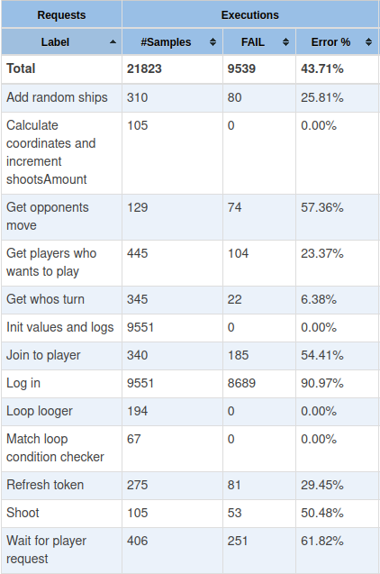
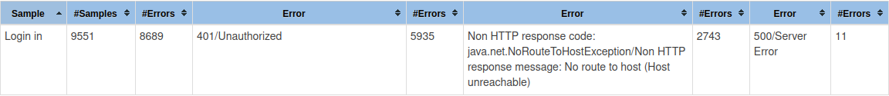
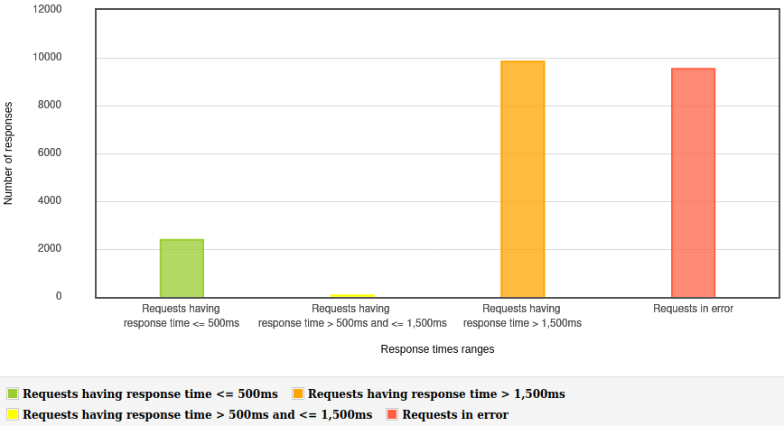
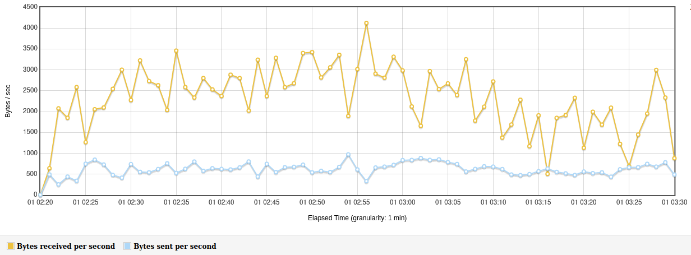

= Analiza projektu battleship
:authors: Kamil Jankowski, Michał Jędrzejkiewicz, Hubert Milczarek

== Funkcjonalność
=== Uruchominie aplikacji

* Żeby uruchomić aplikacje potrzebujemy pobrać repozytorium projektu i zainstalować ją.
Następnie możemy uruchomić grę w przeglądarce.
* Główny serwer bakcendu znajduje się na _Heroku_.
Po uruchomieniu jesteśmy w stanie się z nim połączyć.

=== Logowanie i rejestracja

* Sa udostępnione widoki logowania i rejestracji.
Do zarejestrowania wymagany jest adres e-mail i nazwa użytkownika.
Nie ma możliwości zarejestrowania dwóch użytkowników o tym samym nicku lub adresie e-mail.
Nie ma też możliwości trwałego usunięcia gracza.
* Do gry jest w stanie zalogować się dowolna liczba użytkowników.
* Nie jesteśmy automatycznie wlogowywani z gry po zamknięciu przeglądarki.

=== Widok _home_

* Po zalogowaniu przenoszeni jesteśmy do ekranu "home".
Obok nasdzych danych wyświetlane są globalne statystyki gry.
Oprócz tego można zobaczyć wszystkich aktywnych użytkowników.
Po kliknięciu przycisku _Wait for opponent_ jesteśmy oznaczani jako gotowi do gry.
Jeżeli którykolwiek z pozostałych graczy _join_ jesteśmy, rozpoczynamy nową grę i przenoszeni jesteśmy do ekranu ustawiania statków.
* W poczekalni nie ma automatycznego aktualizowania listy czekajacych graczy.
Do tego trzeba używać przycisku _refresh_.
Nie ma też możliwości wysyłania zaproszenia do konkretnego gracza.

=== Widok ustawiania statków

* W widoku ustawiana statków, możemy wybrać opcję losowego ustawienia.
* W momencie gdy ustawimy statki, musimy poczkeać na drugiego gracza.
* Na ustawienie statkóœ mamy 25 sekund.
Jeśli się nie wyrobimy, zostanie przeniesieni do widoku home.
* W momencie gdy oboje gracze mają ustawione statki, jesteśmy przenoszeni do ekranu pla

=== Widok _game_

* Widok _game_ wygląda jak klasyczna plansza do gry w statki.
Po lewej stronie, wyświetlane są nasze statki, po prawej nasze strzały do statków przeciwnika.
* Mamy 25 sekund na strzał.
Jeśli ten czas minie, po oddaniu strzału jesteśmy informowani, że przegraliśmy.
Przeciwnik jest informowany od razu, o tym że wygrał z powodu spóźnienia drugiego gracza.
* W momencie gdy zestrzelimy cały statek, pola wokół tego statku są wyłączone z dalszej gry.
* Jeśli zamkniemy okno przeglądarki ale wrócimy w ciągu 25 sekund od początku naszej kolejki, jesteśmy w stanie kontunuować grę.
* W momencie/zwycięstwea przegranej wyświetla się przycisk przejścia do widoku _home_.
* Po skończonej grze, aktualizowane są statystyki.

== Ogólny opis projektu

=== Używane technologie

* Projekt jest budowany przy użyciu _Mavena_.
Do budowania użyto także _Dockera_.
* Projekt zbudowany został w opraciu o framework _Spark_.
* Do obsługi ządań w formacie JSON (serializacji i deserializacji) używany jest pakiet _GSON_.
* Do wstrzykiwania zalezności użyto framework _guice_.
* Korzystano także ze _Swaggera_ do dokumentacji REST API.
* Testy jednostkowe napisane zostały przy użyciu _TestNG_ oraz _Mockito_.
* Frontend został zbudowany w oparciu o technologię _Thymeleaf_.

=== Backend

* Dla backendu wszelkie punkty końcowe zdefiniowane zostały w `BackendServiceEndpoints`.
* Poszczególne komponenty backendu zgrupowane są w odpowiednich klasach:
`GameService`, `PlayerService`, `UserSerivce`, `TokeSeervice`.
Dla każdej klasy jest utworzona odpowiadająca klasa `Controller` zawierająca odpowiednie metody do obsługi żądań REST.
* Kod miejscami nie jest kalisteniczny.
Klasa `Game` zawiera 17 pól.
Poza tym wiele klas i metod jest publicznych mimo iż nie soą używane poza pakietem.
* W całym backendzie nie ma dokumentacji _javadoc_ dla publicznych elementów API.
Utrudnia to rozeznawanie się w kodzie.
* Całość jest dość dobrze podzielona na poszczególne Kontrolery.
Nie ma niepotrzebnych zależności pomiedz← klasami poszczególnych komponentów.
* Jeżeli serwis korzysta z API innego serwisu, robi to poprzez klasę `Service`.
Klasy `Controller` wykorzystywane są tylko do komunikacji z frontendem.
* Poszczególne komponenty mogą być łątwo podzielone na mikroserwisy.

=== Frontend

=== Testy jednostkowe

* Pokrycie testami jest na poziomie 31%.
Przez to wiele ważnych funkcjonalności projektu nie jest przetestowana.
* W pakiecie `com.epam.javaacademy.battleship.backend.game` testy jednostkowe zostały napisane dla funkcjonalności Planszy i Współrzędnych.
Brak natomiast dokładnych testów dla losowego rozmieszczania statków.
* Pakiet `com.epam.javaacademy.battleship.backend.user` jest najbardziej pokrytym testami jednostkowymi pakietem w projekcie (ponad 60%).
* We frontendzie testy jednostkowe napisane są w nie.

== Testy

Aby zbadać możliwości aplikacji postanowiono napisać test obciążeniowy. Główny scenariusz został odwzorowany w narzędziu `JMeter`- otwartym projekcie napisanym w 100% w Javie napisany z myślą o testowaniu aplikacji internetowych - a dodatkowo, posłużyliśmy się `Selenium`. Przepływ testu został dostosowany tak, aby możliwie jak najbardziej pokazywał realną interakcję użytkownika z programem. W tym celu posłużono się losowymi przerwami w czasowymi między kolejnymi krokami testu.

=== Test 0

Pierwszym krokiem przy testowaniu było sprawdzenie jak, zareaguje aplikacja na ciągłe zapytania o rejestracje użytkownika. Test został napisany w `Selenium`, gdzie rejestrowanych było 10 000 użytkowników w jednym wątku. Test nie mógł dojść do końca, ponieważ serwis generował na tyle duże opóźnienia, że program nie mógł poprawnie wykonywać swoich poleceń. +
Drugim podejściem był test napisany w czystej Jawie z użyciem `OkHttp`. Podobnie jak w poprzednim przypadku, opóźnienia uniemożliwiły przeprowadzanie testu. Podczas wykonywania wyrzucany był wyjątek:
----
java.net.SocketTimeoutException: timeout
----

Gdy udało się ręcznie osiągnąć liczbę 10 tysięcy użytkowników, strona główna programu wczytywała się ponad 8 sekund.

=== Test 1

Wyniki testu numer 0 wymusiły redukcję użytkowników do liczby 1000. Testy nadal nie były w 100% możliwe, natomiast łatwo było osiągnąć tą liczbę poprzez odpowiednią manipulację czasem odpowiedzi. W tym przypadku został uruchomiony test wykorzystujący `JMeter`. Scenariusz testowy:

. Logowanie użytkownika.
. Jeśli wątek ma nieparzystą liczbę: stwórz pokój i czekaj na przeciwnika +
W przeciwnym przypadku: dołącz do gry.
. Wygeneruj losową mapę.
. Strzelaj po kolei do każdej komórki na przemian z przeciwnikiem.

Dużym problemem w teście jest synchronizacja użytkowników. Jeśli kilku użytkowników będzie chciało się podłączyć do jednego pokoju, może się okazać, że tylko jeden z nich dostanie się do środka, a reszta otrzyma błędy w odpowiedzi. Każdy wątek (użytkownik) jest uruchamiany 3 sekundy po poprzednim. Zatem przy 1000 użytkownikach, daje to 50 minut na uruchomienie wszystkich wątków. W przeciwnym przypadku serwer zwraca mnóstwo błędów.

Wyniki prezentują się poniżej:

.Tabela żądań wraz z ich procentową ilością błędów.
[#img-sunset]
[caption="Obraz 1: "]

Z zamieszczonej ilustracji widać, że procedura `Log in` kończy się sukcesem jedynie w 9%.

.Trzy najczęstsze błędy w w procedurze `Log in`.
[#img-sunset]
[caption="Obraz 2: "]

Z obrazu numer dwa można dowiedzieć się, co powodowało tak małą ilość sukcesów. Pomimo tego, że użytkownicy byli zarejestrowani w systemie, odpowiedzi na żądania `Log in` zawierały status `401/Unauthorized`.

.Czas odpowiedzi na żądania.
[#img-sunset]
[caption="Obraz 3: "]

Kolejny obraz przedstawia czas odpowiedzi na żądania. Mnóstwo żądań kończy się błędem.

.Przepływność bitowa w czasie.
[#img-sunset]
[caption="Obraz 4: "]

Na końcu przedstawiona jest przepływność w czasie.

=== Błędy po stronie serwera

W trakcie wykonywania testów zbierane były logi z serwera. Zawierają one cenne informacje o możliwych przyczynach powyżej opisanych problemów.

. Przepełniona pamięć.
+
----
Process running mem=820M(159.8%)
Error R14 (Memory quota exceeded)

Process running mem=1111M(217.1%)
Error R15 (Memory quota vastly exceeded)
----
+
Dokumentacja `Heroku` zaznacza, że przekroczenie przydzielonej pamięci powoduje drastyczny spadek w szybkości działania aplikacji.

. Problemy z `Hibernate`
+
----
ERROR org.hibernate.AssertionFailure - HHH000099: an assertion failure occurred (this may indicate a bug in Hibernate, but is more likely due to unsafe use of the session): org.hibernate.AssertionFailure: collection was processed twice by flush()
----

. Brak odpowiedzi na żądanie przez 30 sekund - błęd `Heroku` H12
+
----
heroku[router]: at=error code=H12 desc="Request timeout" method=POST path="/game" host=ja-battleship.herokuapp.com request_id=a61e157a-08e6-45fe-99dd-74fabd9804db fwd="89.64.58.173" dyno=web.1 connect=0ms service=30000ms status=503 bytes=0 protocol=http
----
Warto tu zaznaczyć, że serwer w tym momencie wyświetla kod błędu 503.

. Zamknięcie połączenia bez odpowiedzi
+
----
heroku[router]: at=error code=H13 desc="Connection closed without response" method=POST path="/users" host=ja-battleship.herokuapp.com request_id=4c77aaef-7dfe-47e0-b502-3779a7c7c145 fwd="89.64.58.173" dyno=web.1 connect=1ms service=73ms status=503 bytes=0 protocol=https
----

. Problemy z wielowątkowością
+
----
2021-02-01 ERROR spark.http.matching.GeneralError -
java.util.ConcurrentModificationException: null
at java.base/java.util.HashMap.forEach(HashMap.java:1339)
----

=== Podsumowanie

Aby aplikacja była w stanie obsłużyć 10 000 użytkowników należy poprawić:

. Opóźnienia
+
Darmowa wersja Heroku oferuje ograniczone zasoby, które nie są wystarczające, aby zaspokoić wymagania stawiane w 2021 roku. Moc obliczeniowa oraz przeznaczona pamięć są zbyt małe, aby obsłużyć 10 tysięcy użytkowników. Przejście na płatną wersję `Heroku` lub zakup odpowiedniego sprzętu pozwoli na przyspieszenie aplikacji.
+
. Poprawienie aplikacji pod kątem wielowątkowości.
+
Zanim aplikacja trafi na produkcje, musi zostać wyeliminowany problem z wielowątkowością objawiający się wyjątkiem `ConcurrentModificationException`.

. Poprawienie błędu związany z `Hibernate`.
+
Błąd `HHH000099: an assertion failure occurred`
